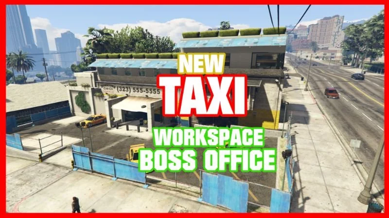
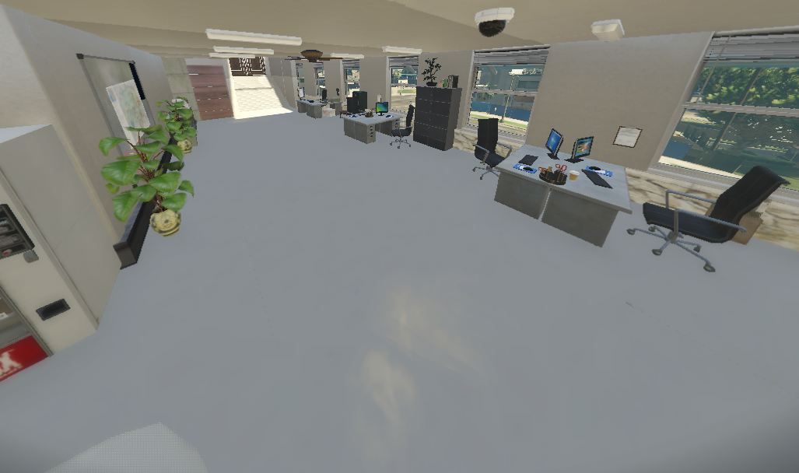
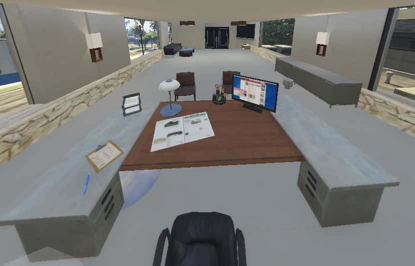

# FiveM Taxi Office YMAP MLO



## Overview

This FiveM modification adds a taxi office interior to your server using the YMAP MLO (Map Modification) format. It provides a realistic and immersive environment for players to use as a taxi dispatch center.

## Features

- Realistic and detailed taxi office interior.
- Designed for a seamless integration with your FiveM server.
- Adds depth and immersion to your roleplay experience.

## Installation

Follow these steps to install the Taxi Office YMAP MLO on your FiveM server:

1. **Download**: Clone this repository or download the ZIP file and extract it to your server's resources folder.

2. **Resource Configuration**: Add the following line to your `resources.cfg` file:

    ```ini
    ensure TaxiOffice
    ```

3. **Start the Resource**: Start the `TaxiOffice` resource in your server.cfg file.

4. **Restart Your Server**: Restart your FiveM server to apply the changes.

## Usage

- In-game, players can visit the taxi office to request a taxi or engage in roleplay activities related to taxi services.
- Administrators can use this interior to create events, missions, or scenarios centered around taxi services.

## Support

If you encounter any issues or have questions, please feel free to open an issue on this GitHub repository.

## Screenshots





## Frequently Asked Questions

- Free? YES!
